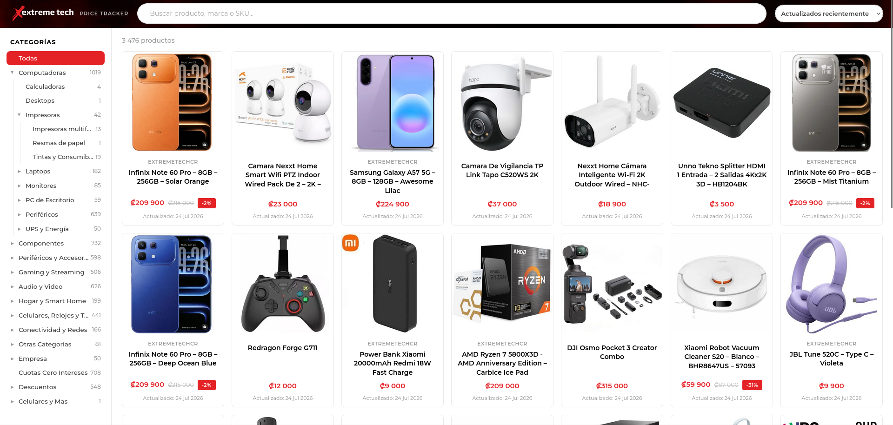

# ExtremeDatabase

Rastreador de precios (estilo [SteamDB](https://steamdb.info)) del catálogo de
ExtremeTech, muestra sus productos y su histórico de precios con gráficas y
estadísticas.

**[Visitar el sitio](https://extremedb.mendozac.cr/)**



Los datos y las imágenes los **recopila un scraper** que los publica
periódicamente, esta web únicamente expone la información recopilada.


## Cómo funciona

```
Next.js 15 (App Router, TypeScript, Tailwind v4) desplegado en Vercel
  Server Components → consultan Postgres directo (cache de datos 1 h)
  /                 → catálogo SSR: búsqueda, categorías, orden y paginación en la URL
  /p/[id]           → detalle SSR por producto con metadata OG y gráfica de histórico
Supabase      → Postgres         Base de datos (solo lectura)
Cloudflare R2 → imágenes         Imágenes de productos (via next/image)
```

## Desarrollo local

```bash
npm install
cp .env.example .env   # completar variables
npm run dev            # http://localhost:3000
```

| Variable | Descripción |
|---|---|
| `SUPABASE_DB_URL` | Connection string de Postgres (pooler, apto para serverless) |
| `R2_PUBLIC_BASE` | Base pública del bucket de imágenes, sin slash final |


## Estructura

```
app/             # rutas: page.tsx (catálogo), p/[id] (detalle), sitemap, robots
components/      # Header, SearchBox, CategoryTree, ProductCard, PriceChart, …
lib/             # db (postgres.js), queries, cache (1 h), format, types
public/assets/   # logo, favicon, textura del header
```

## Nota sobre el histórico

La gráfica y las estadísticas se enriquecen con cada corrida del tracker: solo se guarda
un punto nuevo cuando el precio o el stock cambian. La recolección en producción comenzó
el **24 de julio de 2026**, los datos existen a partir de esa fecha.

## Aviso

Proyecto **independiente y sin afiliación** con ExtremeTech. Los nombres, datos e
imágenes de productos pertenecen a ExtremeTech y sus proveedores. Sitio oficial:
[extremetechcr.com](https://extremetechcr.com/).

## Licencia

El código de este repositorio está bajo licencia [MIT](LICENSE). Los datos e imágenes de
productos que el sitio muestra **no** están cubiertos por esta licencia.
