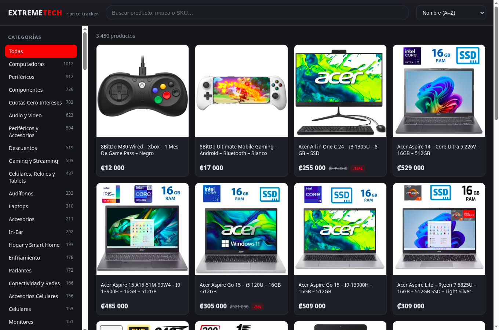

# ExtremeTech Viewer

Web para explorar el catálogo de ExtremeTech y el **histórico de precios** que recolecta el
[tracker](../extremetech-tracker). Frontend estático + API serverless en **Vercel**, datos en
**Supabase (Postgres)** e imágenes servidas desde **Cloudflare R2**.



## Qué incluye

- **Landing** con grid de productos (imagen, precio, descuento, stock).
- **Buscador** por nombre, marca o SKU (con debounce).
- **Filtro por categorías** (como el sitio oficial) con conteos.
- **Orden**: nombre, precio ↑/↓, mayor descuento.
- **Vista de detalle** por producto con:
  - **Gráfica de histórico de precio** (SVG propia, interactiva, sin dependencias).
  - **Estadísticas**: precio actual, **más bajo** y cuándo, **más alto** y cuándo.
  - Categorías, SKU y enlace a la tienda oficial.

## Arquitectura

```
Vercel CDN  ──  public/            (frontend estático: HTML/CSS/JS vanilla)
Vercel Fn   ──  api/index.js       (app Express → /api/*, cacheada 1h en el CDN)
                  └─ lib/queries.js  (postgres.js → Supabase, Transaction Pooler)
Supabase    ──  products, price_history, latest_price, product_categories
Cloudflare R2 ─ imágenes públicas  (products/{id}.ext, thumbs/{id}.ext)
```

Los datos y las imágenes los **empuja el scraper** ([extremetech-tracker](../extremetech-tracker))
al final de cada corrida — este repo solo lee.

## Variables de entorno

Copiar `.env.example` a `.env` (local) y configurarlas también en Vercel (production + preview):

| Variable | Descripción |
|---|---|
| `SUPABASE_DB_URL` | Connection string del **Transaction Pooler** de Supabase (puerto 6543) |
| `R2_PUBLIC_BASE` | Base pública del bucket R2 (ej. `https://pub-xxxx.r2.dev`), sin slash final |

## Desarrollo local

```bash
npm install
npm start          # http://localhost:4000 (lee .env si existe)
```

## Deploy en Vercel

```bash
vercel link
vercel env add SUPABASE_DB_URL      # pooler 6543
vercel env add R2_PUBLIC_BASE
vercel                              # preview
vercel --prod
```

La API responde con `Cache-Control: s-maxage=3600, stale-while-revalidate=86400`: como los
datos cambian 2 veces al día (cron del scraper), el CDN de Vercel sirve casi todo y las
funciones apenas se invocan.

## Estructura

```
api/index.js     # entrypoint de Vercel (exporta la app Express)
server.js        # entrypoint de desarrollo local (app.listen)
lib/
├── db.js        # cliente postgres.js (prepare:false para el pooler; numeric/int8 → Number)
├── queries.js   # queries a Supabase + armado del árbol de categorías
└── app.js       # rutas Express: /api/categories(/tree), /api/recent, /api/products(/:id)
public/
├── index.html   # estructura
├── styles.css   # tema oscuro estilo tienda tech
└── app.js       # lógica: grid, búsqueda, filtros, detalle + gráfica SVG
```

## Nota sobre el histórico

La gráfica y las estadísticas se enriquecen conforme el tracker corre a diario y detecta
cambios (guarda un punto nuevo solo cuando el precio o el stock cambian).
